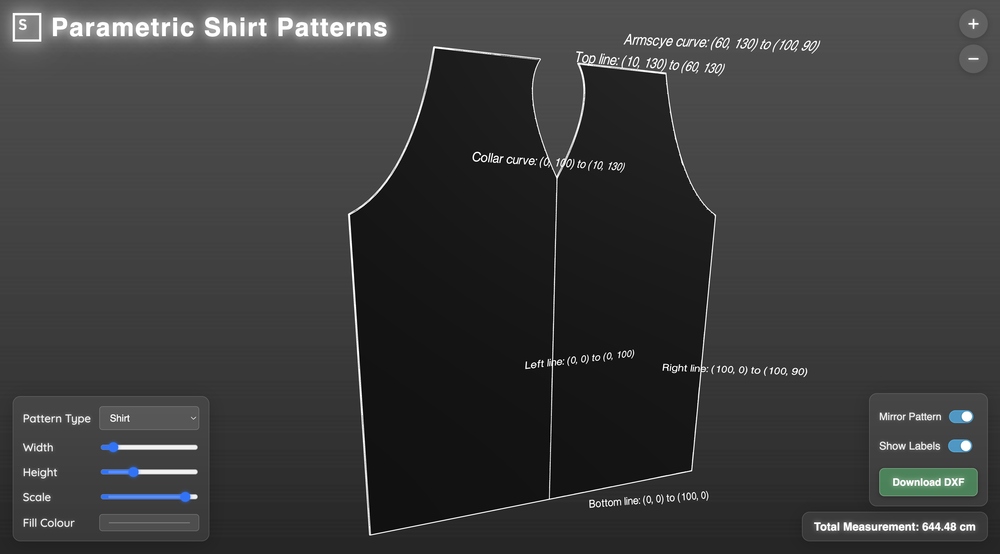
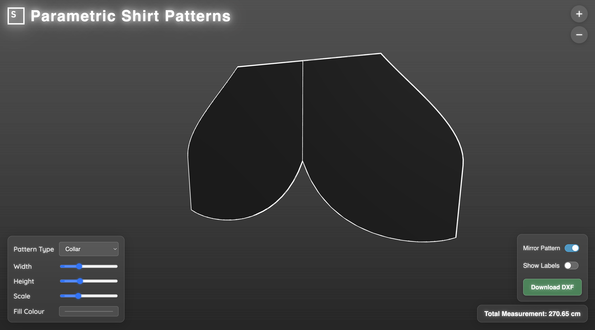

A simple Flask-based webapp for generating and visualizing 3D parametric garment patterns that are formed using lines and Bézier curves. I created this mini-project as a technical case study for Six Atomic.

To try it out locally in your browser, run `python3 app.py` in your terminal after cloning and navigation. Currently, it includes two pre-defined shirt-oriented patterns to play around with:

